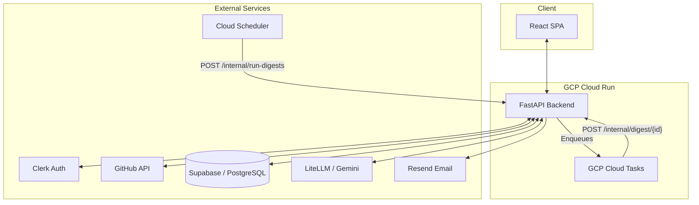

# DevPulse

[](https://github.com/HardityaGhuman/DevPulse/actions)
[](https://reactjs.org/)
[](https://fastapi.tiangolo.com/)
[](https://supabase.com/)

**DevPulse** delivers a neatly formatted digest of your GitHub activity by email — daily or weekly — written by an AI coach. It aims to be a better progress tracker than GitHub's own notifications: accurate contribution counts, streaks, week-over-week momentum, and a nudge on the pull requests waiting on you.

---

## The Problem It Solves

Keeping track of your own development progress is tedious, and GitHub's notifications are noisy. DevPulse aggregates your real GitHub activity for the period and emails you a clean, fact-driven digest: a one-line AI summary and momentum read, your activity stats with week-over-week deltas, your streak, the repos you touched, and — most usefully — the pull requests waiting on you.

## Key Features

- **Automated Developer Digests** — Opt into daily or weekly email summaries. Facts are rendered directly (counts, deltas, streak, waiting PRs); the LLM adds only a one-line headline and a momentum read — no filler.
- **Clean, fixed-light email** — a professional, email-safe template (locked to light so dark-mode clients can't invert it into a mess).
- **Accurate GitHub Activity** — Uses GitHub's GraphQL `contributionsCollection` API: commits, PRs, issues, reviews, active repos, and current streak — including private repositories.
- **PRs Waiting On You** — Surfaces open PRs you authored or that request your review, so nothing stalls.
- **Week-over-Week Momentum** — Compares against your previous digest for real deltas, not guesses.
- **GitHub OAuth via Clerk** — Sign in with GitHub. DevPulse reads your activity on your behalf; your GitHub token is never stored.

---

## How It Works

A React single-page app talks to a stateless FastAPI service over a JSON API.

### Architecture



1. **Authentication** — Sign in with GitHub through Clerk. The frontend attaches a Clerk-issued JWT to every request. The backend verifies the token against Clerk's JWKS, checks the issuer, and looks up (or auto-provisions) the user.
2. **GitHub access** — The backend fetches the user's GitHub OAuth token **live from Clerk** for each request and holds it in memory only — it is never persisted.
3. **Digest generation** — Activity is assembled into a typed context and passed to the LLM layer via **LiteLLM** (model-agnostic). The prompt follows the PTCF framework; output is validated against a strict schema.
4. **Persistence** — Digests are stored in PostgreSQL (Supabase), one row per period.
5. **Scheduled delivery** — an external cron (cron-job.org) calls a shared-secret-protected internal endpoint daily. The backend selects due users (daily every day, weekly on their chosen day), generates each digest, and emails it via Resend.

### Tech stack

**Frontend** — React + Vite, Tailwind CSS, React Router, Clerk for authentication.

**Backend** — FastAPI (Python 3.13), Supabase (PostgreSQL), LiteLLM (Gemini 2.5 Flash primary, Groq OpenAI gpt-oss-120b fallback), Resend for email. Deployed on Google Cloud Run.

### Security highlights

- **JWT auth via Clerk** — Signature (RS256/JWKS), issuer, and TTL-cached keys; generic errors.
- **Signed webhooks** — The Clerk user-sync webhook requires a valid Svix signature.
- **No stored secrets** — GitHub tokens are fetched live from Clerk, never written to the DB.
- **Rate limiting** — Per-user limits on the LLM and email endpoints.
- **RLS backstop** — Row Level Security enabled; the backend uses the service role.

---

## Deployment (Google Cloud Run + Cloud Scheduler)

The backend is a stateless container; scheduling lives outside the app.

**1. Configure env** — copy `backend/.env.example` to `.env` and fill in every value.

**2. Deploy the API:**

```bash
cd backend
gcloud run deploy devpulse-api --source . --region <region> \
  --allow-unauthenticated --max-instances=2
```

Then set the environment variables (all keys from `.env.example`) in the Cloud Run Console
→ *Edit & deploy new revision → Variables & Secrets*. Doing it in the Console avoids shell
quoting issues with values that contain spaces (e.g. `EMAIL_FROM`). Env vars persist across
future `gcloud run deploy` runs.

**3. Schedule the digest cron** — create a job on [cron-job.org](https://cron-job.org) (or any
scheduler):
- URL: `<service-url>/internal/run-digests`
- Method: `POST`
- Header: `X-Internal-Secret: <INTERNAL_CRON_SECRET>`
- Schedule: daily, e.g. 08:00

Any HTTP scheduler works — the endpoint just needs the secret header. (Google Cloud Scheduler
is a fine alternative if you prefer staying inside GCP.)

**4. Database** — run `database/schema.sql` on a fresh Supabase project, or `database/migration.sql` to upgrade an existing one.

The frontend deploys separately (e.g. Vercel) and points at the Cloud Run URL.

---

## Local Development

**Backend:**
```bash
cd backend
python -m venv venv && source venv/bin/activate
pip install -r requirements-dev.txt
cp .env.example .env    # fill in values
uvicorn app.main:app --reload   # http://localhost:8000
pytest                          # run the test suite
```

**Frontend:**
```bash
cd frontend
npm install
npm run dev                     # http://localhost:5173
```

The frontend reads the API base from `VITE_API_BASE_URL` (defaults to
`http://localhost:8000`). To point it at the deployed backend, set in `frontend/.env`:
```
VITE_API_BASE_URL=https://devpulse-api-813251153590.asia-south1.run.app
```
Auth tokens are Clerk session JWTs, attached automatically by `src/lib/api.js`.

## Project Layout

```
backend/          FastAPI service (see app/ structure below)
  app/security/   Clerk JWT, Svix webhook, cron-secret guards
  app/clients/    external APIs — Clerk, GitHub GraphQL
  app/services/   ai (LiteLLM), digest orchestration, Resend email
  app/routers/    users, digest, github, internal (cron)
database/         schema.sql (fresh) + migration.sql (upgrade)
frontend/         React + Vite SPA (next up for a UI pass)
```

## Status & Next Steps

Backend + auth are refactored, secured, and deployed on Cloud Run via automated GitHub Actions CD. We have comprehensive test coverage for core services, structured logging, and observability metrics in place. Digest frequency is interval-based (`off / 6h / 12h / daily / weekly`); a single cron fans out to whoever's due, with support for Google Cloud Tasks queueing.

**Next phase: Host this service so that other users can access freely** 