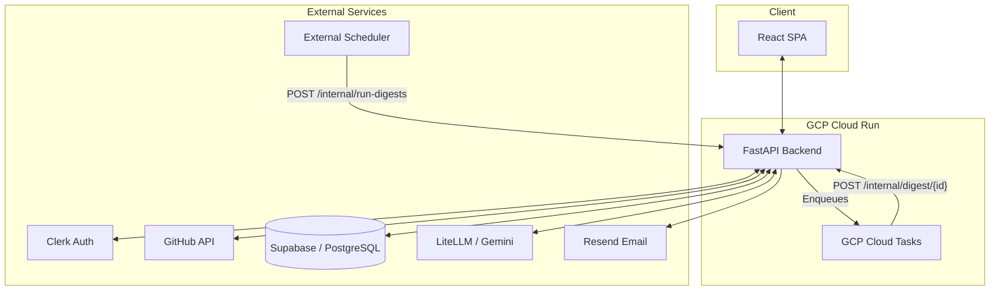

# DevPulse

[](https://github.com/HardityaGhuman/DevPulse/actions)
[](https://reactjs.org/)
[](https://fastapi.tiangolo.com/)
[](https://supabase.com/)

**DevPulse** delivers a neatly formatted digest of your GitHub activity by email, on a cadence you pick. It aims to be a better progress tracker than GitHub's own notifications: accurate contribution counts, streaks, week-over-week momentum, and a nudge on the pull requests waiting on you. Every figure in the digest is rendered straight from GitHub data — the LLM writes only the one-line headline, so nothing is ever invented.

> **Live:** sign in with GitHub, pick a cadence, and the digest arrives by email.

---

## The Problem It Solves

Keeping track of your own development progress is tedious, and GitHub's notifications are noisy. DevPulse aggregates your real GitHub activity for the period and emails you a clean, fact-driven digest: a one-line AI summary and momentum read, your activity stats with week-over-week deltas, your streak, the repos you touched, and — most usefully — the pull requests waiting on you.

The digest arrives **only by email**. There is no in-app preview or "send now" button — a digest you can pull up on demand isn't a digest, it's a dashboard. DevPulse is deliberately the opposite: it comes to you, on your schedule, and stays out of the way otherwise.

## Key Features

- **Automated developer digests** — Opt into a cadence that suits you: `off / 6h / 12h / daily / weekly`, delivered at an hour (and weekday) you choose, in your own timezone. Every cadence is anchored to your chosen hour, so send times are predictable.
- **Facts, not filler** — Counts, deltas, streak, and waiting PRs are rendered directly from GitHub data. The LLM contributes only a one-line headline and a momentum read; nothing in the digest is invented.
- **Opt-in by default** — a new account starts at `off`. DevPulse never emails anyone who didn't ask for it, and every digest carries a one-click unsubscribe.
- **Clean, email-safe template** — an editorial broadsheet built from tables and inline styles, locked to light so dark-mode clients can't invert it into a mess. Fluid to any width, so it holds up on a phone.
- **Accurate GitHub activity** — Uses GitHub's GraphQL `contributionsCollection` API: commits, PRs, issues, reviews, active repos, and current streak — including private repositories.
- **Scoped to what you care about** — Track a chosen set of repositories; all GitHub fetches are scoped to them.
- **PRs waiting on you** — Surfaces open PRs you authored or that request your review, so nothing stalls.
- **Week-over-week momentum** — Compares against a fixed trailing-7-day window for real deltas, not guesses.
- **GitHub OAuth via Clerk** — Sign in with GitHub. DevPulse reads your activity on your behalf; your GitHub token is never stored.

---

## How It Works

A React single-page app talks to a stateless FastAPI service over a JSON API.

### Architecture



1. **Authentication** — Sign in with GitHub through Clerk. The frontend attaches a Clerk-issued JWT to every request. The backend verifies the token against Clerk's JWKS, checks the issuer, and looks up (or auto-provisions) the user.
2. **GitHub access** — The backend fetches the user's GitHub OAuth token **live from Clerk** for each request and holds it in memory only — it is never persisted.
3. **Digest generation** — Activity is assembled into a typed context and passed to the LLM layer via **LiteLLM** (model-agnostic). The prompt follows the PTCF framework; output is validated against a strict schema. If every model fails, DevPulse falls back to a deterministic facts-only digest rather than skipping a send.
4. **Persistence** — Digests are stored in PostgreSQL (Supabase), one row per period, keyed on `(user_id, period_key)` for interval-aware idempotency.
5. **Scheduled delivery** — an external scheduler calls a shared-secret-protected internal endpoint **at least hourly**. The backend selects the users who are due *at that hour in their own timezone*, fans them out through Cloud Tasks (one retryable task each, so one failure can't block the rest), and emails each digest via Resend. Delivery is idempotent per window: a retry after a successful send can't email anyone twice.

### Tech stack

**Frontend** — React + Vite, Tailwind CSS, React Router, Clerk for authentication. Editorial broadsheet aesthetic (Playfair Display + Inter + JetBrains Mono). Deployed on Vercel.

**Backend** — FastAPI (Python 3.13), Supabase (PostgreSQL), Resend for email. Model-agnostic LLM layer via LiteLLM, tried in order: Gemini 2.5 Flash (primary), then Groq `gpt-oss-20b`, then Groq Qwen3-32B; a deterministic facts-only build catches a total failure. Deployed on Google Cloud Run, with an external scheduler as the clock and Cloud Tasks for per-user fan-out.

### Security highlights

- **JWT auth via Clerk** — Signature (RS256/JWKS), exact issuer match, TTL-cached keys; generic errors. Fails **closed** if the issuer is unconfigured.
- **Signed webhooks** — The Clerk user-sync webhook requires a valid Svix signature.
- **No stored secrets** — GitHub tokens are fetched live from Clerk, never written to the DB.
- **RLS backstop** — Row Level Security enabled; the backend uses the service role, with authz enforced in the app layer.
- **Capability-scoped unsubscribe** — `/api/unsubscribe/{token}` is the one unauthenticated route (mail clients POST it with no session). The URL carries an HMAC token; the only thing it can do is set that one user's cadence to `off`.
- **Verified deliverability** — SPF, DKIM, and DMARC all pass and align; the sender domain is verified with Resend.

---

## Project Layout

```
backend/          FastAPI service
  app/security/   Clerk JWT, Svix webhook, cron-secret, unsubscribe-token guards
  app/clients/    external APIs — Clerk, GitHub GraphQL
  app/services/   ai (LiteLLM), digest orchestration, Resend email
  app/routers/    users, digest, github, internal (cron), unsubscribe
database/         schema.sql (fresh) + migration.sql (upgrade)
frontend/         React + Vite SPA — landing + dashboard
```
